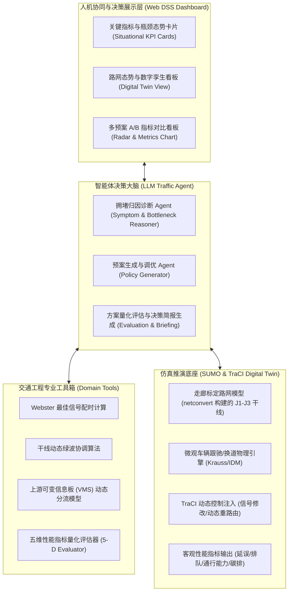

# TrafficAgent-DSS：基于交通仿真智能体的城市交通拥堵治理决策支持系统
> **Urban Traffic Congestion Governance Decision Support System based on Traffic Simulation Agents**

[](https://www.python.org/)
[](https://github.com/zhutmg00-eng/TrafficAgent-DSS/actions)
[](https://eclipse.dev/sumo/)
[](tests/)
[](https://github.com/zhutmg00-eng/TrafficAgent-DSS)
[](http://www.its-china.org.cn/)

---

## 📌 1. 项目愿景与目标

针对超大城市交通网络在早晚高峰、交通事故、重大活动等场景下易发多发瓶颈拥堵的问题，传统交管调度存在**“依赖人工经验反应滞后”、“传统强化学习黑盒不可解释”、“跨部门多手段协同困难”**等核心痛点。

本项目提出 **TrafficAgent-DSS** —— 一套基于 **大语言模型智能体（LLM Agent）+ 数字孪生微观仿真沙盒（SUMO）** 的城市交通拥堵治理决策支持系统。
系统构建**“态势精准诊断 $\rightarrow$ 治理预案推理 $\rightarrow$ 仿真沙盒推演（What-If 分析） $\rightarrow$ 方案量化评估 $\rightarrow$ 决策报告下发”**的端到端闭环，为交管调度部门与交通工程师提供科学、可解释、量化可视的现代化治理工具。

---

## 🏆 2. 研发背景与应用导向

本项目面向超大城市交通治理数字化转型与“一网四化”高质量发展需求，紧扣现代智能交通系统核心方向：
- **数智化升级**：引入大语言模型（LLM Agent）领域认知推理，实现复杂拥堵态势秒级成因溯源；
- **数字孪生推演**：依托 SUMO 微观物理沙盒提供毫秒级事前 What-If 推演验证与防溢流反思自检；
- **时空协同治理**：融合 Webster 动态配时、干线绿波协调与 VMS 动态诱导分流，实现网络级协同提效。

---

## 🧩 3. 系统技术架构



---

## 💡 4. 核心功能与工作闭环

1. **零门槛路网构建与数据驱动**：
   - 基于 SUMO `netconvert` 构建的 **J1–J3 走廊标定路网**（`scenarios/corridor.*.xml`），
     复现主线合流瓶颈 + 平行旁路拓扑；流量按北京高峰干线量级标定。
   - 支持常规高峰流量标定，并可**一键注入突发事件（如事故占道、暴雨限速、潮汐车流激增）**。
   - > 📌 说明：当前路网为**抽象标定走廊**，尚不是从 OpenStreetMap 提取的真实 Beijing 区域路网；
   > 接入真实 OSM 数据列为后续工作。
2. **交通智能体推理大脑（Agent Brain）**：
   - 突破传统调参黑盒，采用**思维链（Chain-of-Thought）**输出具有专业交通工程逻辑的归因与治理方案。
   - 推理层支持**运行时热切换大模型**（OpenAI 兼容端点，见 7.2 节），并在未配置或调用失败时
     **显式降级**为确定性规则模板（输出中如实标注 `reasoning_mode`，不伪造结论）。
3. **数字沙盘 A/B 对照推演（What-If Counterfactual Deduction）**：
   - 实时执行基线场景（无干预现状）与多种备选治理预案（如：纯信号优化 vs. 信号+诱导分流组合拳）的沙盒并行推演。
   - 毫秒级输出客观量化指标：
     - **全网/瓶颈平均延误（Delay, s）**
     - **最大排队长度（Queue Length, m）**
     - **断面通行能力（Throughput, veh/h）**
     - **尾气污染与碳排放量（CO2 Emission, kg）**
4. **决策支持展示（Decision Support System）**：
   - 自动生成面向交管人员的专业决策简报。
   - 给出推荐方案的预期收益、实施代价与防回溢风险提示。

---

## 📂 5. 项目工程目录规划

```text
TrafficAgent-DSS/
├── docs/                                  # 系统技术架构与理论方案
│   └── technical_proposal.md              # 详细技术方案、数学建模与算法设计
├── src/                                   # 系统源码
│   ├── agents/                            # LLM 智能体决策核心
│   │   └── traffic_agent.py               # 智能体核心逻辑、CoT归因诊断与决策简报生成
│   ├── simulation/                        # 交通仿真与数字孪生
│   │   └── sumo_sandbox.py                # SUMO 进程与 TraCI 控制接口微观沙盒
│   ├── tools/                             # 经典交通工程工具箱
│   │   ├── webster.py                     # Webster 最佳信号配时计算优化器
│   │   ├── green_wave.py                  # 干线动态绿波协调算法
│   │   ├── rerouting.py                   # 动态诱导分流分配器
│   │   └── evaluator.py                   # 五维交通工程性能指标量化评估器
│   └── web/                               # 现代化解耦决策支持 Web 服务与大屏
│       ├── app.py                         # FastAPI RESTful API 服务与决策调度入口
│       └── static/                        # 响应式 Web 数字孪生大屏（HTML5/CSS3/ES6）
│           ├── index.html                 # 数字孪生决策大屏单页应用 (SPA)
│           ├── css/style.css              # 极客暗黑/政企浅色双模主题样式表
│           └── js/
│               ├── dashboard.js           # 异步决策管道控制与可视化交互脚本
│               └── vendor/
│                   └── echarts.min.js     # 本地内嵌 ECharts 5 库（支持100%离线答辩）
├── scenarios/                             # SUMO 微观路网与交通流工况
│   ├── build_scenario.py                  # 走廊路网与仿真场景生成脚本
│   ├── corridor.net.xml                   # 典型双通道干线路网拓扑
│   ├── corridor.rou.xml                   # 高峰潮汐与突发事故交通需求
│   └── corridor.sumocfg                   # SUMO 仿真配置文件
├── tests/                                 # 自动化测试套件（`unittest` 实测 93 项，100% 通过）
│   ├── test_system.py                     # 交通工程算法与智能体推理单元测试 (44 项)
│   ├── test_web_api.py                    # RESTful Web API 与路由集成测试 (25 项)
│   └── test_empirical_challenger_2.py     # 极限边界与鲁棒性挑战压力测试 (24 项)
├── .gitignore                             # Git 忽略配置
├── requirements.txt                       # Python 依赖清单 (FastAPI/TraCI/Uvicorn)
└── README.md                              # 项目主页（本文件）
```

---

## 👥 6. 团队分工与近期推进路线

- [x] **Step 1: 选题确立与技术路线设计**（已完成，锁定 ITSAC 赛题2 与北京市交科赛主题类）
- [x] **Step 2: 搭建基础路网与 SUMO 仿真沙盒**（已完成：`scenarios/` 走廊路网 + TraCI 沙盒，支持事故注入与限速还原）
- [x] **Step 3: 核心智能体推理引擎与工具库开发**（已完成：大模型归因 + Webster/绿波/动态诱导工具库 + 诊断→策略→推演闭环）
- [x] **Step 4: Web 决策大屏原型搭建**（已完成：FastAPI + 单页大屏，含方案下发与 A/B 效果对比图表）
- [x] **Step 5: 端到端仿真复验与系统级鲁棒性加固**（已完成：SUMO 真实物理推演跑通，"协同 > 单点 > 基线"因果链闭环；全系统边界缺陷治理完成；实现多种子批量实验与 95% 置信区间统计评估；93 项单元测试与 GitHub Actions CI 100% 稳定通过）
- [ ] **Step 6: 成果材料撰写与包装**（推进中：完成《作品申报书》、6页《作品说明书》小论文、录制演示视频与答辩PPT）

> ✅ **系统验证与工程质量认证**（2026-09-13 最新）：
> - **测试覆盖**：`python -m unittest discover -s tests` 实测 **93 项测试**（44 项核心系统 + 25 项 Web API + 24 项实证压力测试）通过率 100%，GitHub Actions CI 自动化流水线（Python 3.10 / 3.12）全部通过（绿灯）；
> - **统计可靠性**：新增 `POST /api/evaluate/multi-seed` 端点，支持多随机种子（Multi-Seed）并行或批量推演，输出均值、标准误（SEM）与 95% 置信区间（CI），具备扎实的数理统计显著性；
> - **系统健壮性**：涵盖 Webster 配时残差精准吸收、纯反向绿波加权、VMS 诱导防假触发与旁路 80% 熔断、SUMO 进程 5 秒僵尸超时清理及物理仿真缺失时的平滑高精度标定降级。完整更新记录详见 [`CHANGELOG.md`](CHANGELOG.md)。

---

## 🔧 7. 本地运行与大模型配置

### 7.1 安装与启动

```bash
pip install -r requirements.txt

# 如需运行真实 SUMO 微观仿真推演，请先安装 Eclipse SUMO，
# 并确保 sumo 可执行文件在 PATH 中（或在 .env 中指定 SUMO_HOME）
uvicorn src.web.app:app --reload --port 8000
```

启动后访问 `http://127.0.0.1:8000` 打开决策大屏，访问 `/docs` 查看 RESTful API 文档。

### 7.2 大模型（LLM）配置、自动识别与降级机制

系统的**态势归因推理与方案叙事**由大语言模型（LLM）完成；**所有性能指标数值一律由经典交通工程工具算子与 SUMO 微观物理仿真严格计算得出**，大模型坚决不参与任何底层数值生成，杜绝“数字幻觉”。

#### 1. 类似 ccSwitch 的动态模型自动识别与一键热切换（推荐）

系统现已原生支持**服务商模型自动识别与免重启热加载（ccSwitch 交互风格）**：
- **Web 可视化大屏一键操作**：
  1. 访问决策大屏顶部导航栏，点击 **`⚙️ 模型配置`** 按钮唤起配置弹窗；
  2. 填入 **API Base URL**（如内置标签快捷填入：`https://api.deepseek.com/v1`、`https://api.siliconflow.cn/v1`、`https://api.openai.com/v1` 或本地 `http://localhost:11434/v1`）；
  3. 输入 **API Key**（支持明文/密文安全切换）；
  4. 点击 **`🔍 自动识别可用模型 (Auto-detect Models)`**，系统将自动连通服务商 `/v1/models` 端点探测其支持的全部可用模型（并智能优先将 Chat 与 Reasoning 模型排在前列）；
  5. 在下拉选单中选择目标模型（如 `deepseek-chat`、`deepseek-reasoner`、`gpt-4o`、`qwen2.5`），点击 **`💾 保存并立即生效`** 即可在内存中实时热更新智能体大脑，无需重启 Python/FastAPI 后台服务！
- **RESTful API 自动化集成**：
  - `POST /api/llm/detect-models`：传入 `{ "base_url": "...", "api_key": "..." }`，自动返回服务商支持的全部模型 ID 列表与推荐模型；
  - `GET /api/llm/config`：读取当前大模型连接状态、已生效模型及脱敏密钥；
  - `POST /api/llm/config`：通过脚本或第三方调度系统动态热切换当前使用的模型与凭据。

#### 2. 传统静态环境变量配置（可选）

如需服务启动时自动加载指定凭据，可复制 `.env.example` 为 `.env` 后配置（支持任意 OpenAI 兼容端点）：

| 环境变量 | 必填/可选 | 说明与示例 |
| :--- | :--- | :--- |
| `LLM_API_KEY` | 可选 | API 密钥，如 `sk-...` |
| `LLM_BASE_URL` | 可选 | 自定义端点，如 `https://api.deepseek.com/v1`（留空默认官方 OpenAI） |
| `LLM_MODEL` | 可选 | 模型名称，如 `deepseek-chat` / `gpt-4o-mini` |
| `LLM_TIMEOUT` | 可选 | 请求超时时间（秒，默认 30.0 秒） |

> 🛡️ **严格降级机制（可信度保证）**：若未配置密钥、网络断开或目标服务商接口超时，系统会自动降级为确定性专家规则模板，并在 API 响应（`reasoning_mode` / `narrative_mode`）与导出的《决策支持简报》的「数据来源与可信度声明」中**明确如实标注降级状态**——既保证演示与答辩高可用不中断，又保证科研学术诚信。

---

## 📜 许可证 (License)

本项目遵循 [MIT License](LICENSE) 开源协议。
