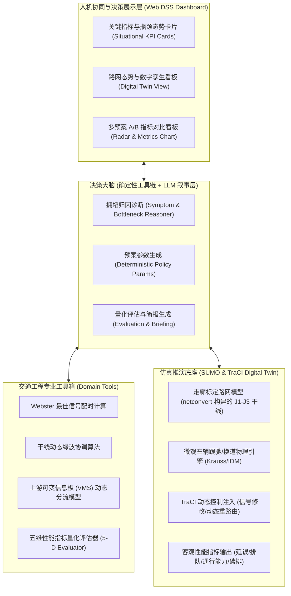

# TrafficAgent-DSS：基于交通仿真智能体的城市交通拥堵治理决策支持系统
> **Urban Traffic Congestion Governance Decision Support System based on Traffic Simulation Agents**

[](https://www.python.org/)
[](https://github.com/zhutmg00-eng/TrafficAgent-DSS/actions)
[](https://eclipse.dev/sumo/)
[-success.svg)](tests/)
[](https://playwright.dev/)
[](https://github.com/zhutmg00-eng/TrafficAgent-DSS)
[](https://lbsyun.baidu.com/)
[](http://www.its-china.org.cn/)

---

## 📌 1. 项目愿景与目标

针对超大城市交通网络在早晚高峰、交通事故、重大活动等场景下易发多发瓶颈拥堵的问题，传统交管调度存在**“依赖人工经验反应滞后”、“传统强化学习黑盒不可解释”、“跨部门多手段协同困难”**等核心痛点。

本项目提出 **TrafficAgent-DSS** —— 一套基于 **大语言模型智能体（LLM Agent）+ 数字孪生微观仿真沙盒（SUMO）** 的城市交通拥堵治理决策支持系统。
系统构建**“态势精准诊断 $\rightarrow$ 治理预案推理 $\rightarrow$ 仿真沙盒推演（What-If 分析） $\rightarrow$ 方案量化评估 $\rightarrow$ 决策报告下发”**的端到端闭环，为交管调度部门与交通工程师提供科学、可解释、量化可视的现代化治理工具。

---

## 🏆 2. 研发背景与应用导向

本项目面向超大城市交通治理数字化转型与“一网四化”高质量发展需求，紧扣现代智能交通系统核心方向：
- **数智化升级**：引入大语言模型（LLM Agent）领域认知推理，实现复杂拥堵态势秒级成因溯源；
- **数字孪生推演**：依托 SUMO 微观物理沙盒提供毫秒级事前 What-If 推演验证与防溢流反思自检；
- **时空协同治理**：融合 Webster 动态配时、干线绿波协调与 VMS 动态诱导分流，实现网络级协同提效。

---

## 🧩 3. 系统技术架构



---

## 💡 4. 核心功能与工作闭环

1. **零门槛路网构建与数据驱动**：
   - 基于 SUMO `netconvert` 构建的 **J1–J3 走廊标定路网**（`scenarios/corridor.*.xml`），
     复现主线合流瓶颈 + 平行旁路拓扑；流量按北京高峰干线量级标定。
   - 支持常规高峰流量标定，并可**一键注入突发事件（如事故占道、暴雨限速、潮汐车流激增）**。
   - > 📌 说明：当前路网为**抽象标定走廊**，尚不是从 OpenStreetMap 提取的真实 Beijing 区域路网；
   > 接入真实 OSM 数据列为后续工作。
2. **交通智能体推理大脑（Agent Brain）**：
   - 采用**确定性交通工程规则链**完成归因诊断与治理策略参数生成（Webster / 绿波 / VMS），
     保证每个数值**可溯源、可复算**；大模型（LLM）层负责**可解释叙事与决策简报的文字组织**，
     **不参与任何底层数值生成**（职责边界详见 §7.2）。
   - 推理层支持**运行时热切换大模型**（OpenAI 兼容端点，见 7.2 节），并在未配置或调用失败时
     **显式降级**为确定性规则模板（输出中如实标注 `reasoning_mode`，不伪造结论）。
3. **数字沙盘 A/B 对照推演（What-If Counterfactual Deduction）**：
   - 实时执行基线场景（无干预现状）与多种备选治理预案（如：纯信号优化 vs. 信号+诱导分流组合拳）的沙盒并行推演。
   - 毫秒级输出客观量化指标：
     - **全网/瓶颈平均延误（Delay, s）**
     - **最大排队长度（Queue Length, m）**
     - **断面通行能力（Throughput, veh/h）**
     - **尾气污染与碳排放量（CO2 Emission, kg）**
4. **决策支持展示（Decision Support System）**：
   - 自动生成面向交管人员的专业决策简报。
   - 给出推荐方案的预期收益、实施代价与防回溢风险提示。
5. **百度地图开放平台 LBS 能力与多模式路径规划比选**：
   - 深度集成 **Baidu Map GL JS API 3.0**，提供 WebGL 高性能底图渲染、TrafficLayer 实时动态路况图层（畅通绿/缓行黄/拥堵红）；
   - 后端桥接百度 **DirectionLite 驾车路径规划 API**，自动计算拥堵瓶颈主线与诱导分流绕行路线的时空几何、拥堵距离与通行耗时，为交管调度决策提供权威公网路况佐证与绕行可行性研判。

---

## 📂 5. 项目工程目录规划

```text
TrafficAgent-DSS/
├── docs/                                  # 系统技术架构与理论方案
│   ├── technical_proposal.md              # 详细技术方案、数学建模与算法设计
│   └── review_findings.md                 # 审查报告与系统真实性演进说明
├── experiments/                           # 交通仿真消融实验与基准评测
│   ├── ablation.py                        # 多控制手段消融实验脚本 (Baseline/Webster/GreenWave/VMS/Combo)
│   ├── ablation_result_20260914_multiseed.md # 多种子消融基准报告（5 种子 + 95% CI，README 引用口径）
│   └── ablation_result_20260913_153022.md # 历史单种子快照（仅留档，不作为对外引用口径）
├── scripts/                               # 工具脚本
│   ├── build_network_from_osm.py          # OSM 导出 -> 真实路网 JSON 编译
│   ├── fetch_osm_network.sh               # 一键抓取并编译真实路网脚本
│   └── run_e2e.py                         # Playwright 前端 E2E 自动化测试一键运行脚本
├── src/                                   # 系统源码
│   ├── agents/                            # LLM 智能体决策核心
│   │   ├── llm_client.py                  # 大模型多后端统一调用与模型自动发现客户端
│   │   └── traffic_agent.py               # 智能体核心逻辑、CoT归因诊断与决策简报生成
│   ├── data/                              # 路网拓扑与几何数据层
│   │   └── network.py                     # OSM 真实路网数据模型（拓扑/几何/瓶颈选取）
│   ├── simulation/                        # 交通仿真与数字孪生
│   │   ├── sumo_sandbox.py                # SUMO 进程与 TraCI 控制接口微观沙盒
│   │   └── mesoscopic.py                  # 路网级中观推演引擎（无需 SUMO，逐路段数据）
│   ├── tools/                             # 经典交通工程工具箱
│   │   ├── webster.py                     # Webster 最佳信号配时计算优化器
│   │   ├── green_wave.py                  # 干线动态绿波协调算法
│   │   ├── rerouting.py                   # 动态诱导分流分配器
│   │   └── evaluator.py                   # 五维交通工程性能指标量化评估器
│   └── web/                               # 现代化解耦决策支持 Web 服务与大屏
│       ├── app.py                         # FastAPI RESTful API 服务与决策调度入口
│       ├── network_api.py                 # 真实路网、检测器与行动清单 API
│       └── static/                        # 响应式 Web 数字孪生大屏（HTML5/CSS3/ES6）
│           ├── index.html                 # 数字孪生决策大屏单页应用 (SPA)
│           ├── css/style.css              # 极客暗黑/政企浅色双模主题样式表
│           └── js/
│               ├── baidu_map.js           # 百度地图 GL 控件与 DirectionLite 路线图层管理
│               ├── dashboard.js           # 异步决策管道控制与可视化交互脚本
│               └── vendor/
│                   └── echarts.min.js     # 本地内嵌 ECharts 5 库（支持100%离线答辩）
├── scenarios/                             # 路网数据与 SUMO 微观仿真工况
│   ├── network_xizhimen.json              # 西直门真实路网（OSM）— 供地图渲染与中观推演
│   ├── build_scenario.py                  # 走廊路网与仿真场景生成脚本
│   ├── corridor.net.xml                   # 典型双通道干线路网拓扑
│   ├── corridor.rou.xml                   # 高峰潮汐与突发事故交通需求
│   └── corridor.sumocfg                   # SUMO 仿真配置文件
├── tests/                                 # 自动化测试套件（全量 127 项测试 100% 通过）
│   ├── test_system.py                     # 交通工程算法、真实绿波与智能体推理单元测试 (46 项)
│   ├── test_web_api.py                    # RESTful Web API、百度LBS与路由集成测试 (33 项)
│   ├── test_network_mesoscopic.py         # 真实路网与中观仿真引擎专项测试 (10 项)
│   ├── test_empirical_challenger_2.py     # 极限边界与鲁棒性挑战压力测试 (24 项)
│   └── e2e/                               # Playwright 浏览器端到端前端测试套件 (14 项)
│       ├── conftest.py                    # 独立 FastAPI 后台测试服务 Fixture
│       ├── test_core_ui.py                # 大屏基础渲染、主题切换与全景截图 (3 项)
│       ├── test_llm_modal.py              # 大模型配置弹窗与 ccSwitch 交互流 (3 项)
│       ├── test_maps_ui.py                # 双轨地图 (百度 GL + 西直门 OSM SVG) 验证 (2 项)
│       ├── test_playbook_detectors.py     # 7步实战清单与检测器数据表交互 (2 项)
│       ├── test_rollout_pipeline.py       # 推演流水线、ECharts 挂载与降级横幅 (2 项)
│       └── test_visual_snapshots.py       # 1080p/768p 多分辨率视觉快照存档 (2 项)
├── .gitignore                             # Git 忽略配置
├── requirements.txt                       # Python 依赖清单 (FastAPI/TraCI/Uvicorn/Playwright)
└── README.md                              # 项目主页（本文件）
```

---

## 👥 6. 团队分工与近期推进路线

- [x] **Step 1: 选题确立与技术路线设计**（已完成，锁定 ITSAC 赛题2 与北京市交科赛主题类）
- [x] **Step 2: 搭建基础路网与 SUMO 仿真沙盒**（已完成：`scenarios/` 走廊路网 + TraCI 沙盒，支持事故注入与限速还原）
- [x] **Step 3: 核心智能体推理引擎与工具库开发**（已完成：大模型归因 + Webster/绿波/动态诱导工具库 + 诊断→策略→推演闭环）
- [x] **Step 4: Web 决策大屏原型搭建**（已完成：FastAPI + 单页大屏，含方案下发与 A/B 效果对比图表）
- [x] **Step 5: 端到端仿真复验与系统级鲁棒性加固**（已完成：SUMO 真实物理推演跑通，"协同 > 单点 > 基线"因果链闭环；全系统边界缺陷治理完成；实现多种子批量实验与 95% 置信区间统计评估；93 项单元测试与 GitHub Actions CI 100% 稳定通过）
- [ ] **Step 6: 成果材料撰写与包装**（推进中：完成《作品申报书》、6页《作品说明书》小论文、录制演示视频与答辩PPT）

> ✅ **系统验证与工程质量认证**（2026-09-13 最新）：
> - **测试覆盖**：`python -m unittest discover -s tests` 实测 **113 项测试**（46 项核心系统 + 33 项 Web API 与百度 LBS + 10 项中观拓扑 + 24 项实证压力测试）通过率 100%，GitHub Actions CI 自动化流水线（Python 3.10 / 3.12）全部通过（绿灯）；
> - **统计可靠性**：新增 `POST /api/evaluate/multi-seed` 端点，物理仿真模式下支持多随机种子（Multi-Seed）并行推演，输出均值、标准误（SEM）与 95% 置信区间（CI）；非物理模式如实声明样本特征，杜绝人工伪造统计假象；
> - **系统健壮性**：涵盖 Webster 配时残差精准吸收、图解法公共交集真实绿波带宽计算、VMS 诱导防假触发与旁路 80% 熔断、SUMO 进程 5 秒僵尸超时清理及物理仿真缺失时的平滑高精度标定降级。完整更新记录详见 [`CHANGELOG.md`](CHANGELOG.md)。

---

## 🔧 7. 本地运行与大模型配置

### 7.1 安装与启动

```bash
pip install -r requirements.txt

# 如需运行真实 SUMO 微观仿真推演，请先安装 Eclipse SUMO，
# 并确保 sumo 可执行文件在 PATH 中（或在 .env 中指定 SUMO_HOME）
uvicorn src.web.app:app --reload --port 8000
```

启动后访问 `http://127.0.0.1:8000` 打开决策大屏，访问 `/docs` 查看 RESTful API 文档。

### 7.2 大模型（LLM）配置、自动识别与降级机制

系统的**态势归因推理与方案叙事**由大语言模型（LLM）完成；**所有性能指标数值一律由经典交通工程工具算子与 SUMO 微观物理仿真严格计算得出**，大模型坚决不参与任何底层数值生成，杜绝“数字幻觉”。

#### 1. 类似 ccSwitch 的动态模型自动识别与一键热切换（推荐）

系统现已原生支持**服务商模型自动识别与免重启热加载（ccSwitch 交互风格）**：
- **Web 可视化大屏一键操作**：
  1. 访问决策大屏顶部导航栏，点击 **`⚙️ 模型配置`** 按钮唤起配置弹窗；
  2. 填入 **API Base URL**（如内置标签快捷填入：`https://api.deepseek.com/v1`、`https://api.siliconflow.cn/v1`、`https://api.openai.com/v1` 或本地 `http://localhost:11434/v1`）；
  3. 输入 **API Key**（支持明文/密文安全切换）；
  4. 点击 **`🔍 自动识别可用模型 (Auto-detect Models)`**，系统将自动连通服务商 `/v1/models` 端点探测其支持的全部可用模型（并智能优先将 Chat 与 Reasoning 模型排在前列）；
  5. 在下拉选单中选择目标模型（如 `deepseek-chat`、`deepseek-reasoner`、`gpt-4o`、`qwen2.5`），点击 **`💾 保存并立即生效`** 即可在内存中实时热更新智能体大脑，无需重启 Python/FastAPI 后台服务！
- **RESTful API 自动化集成**：
  - `POST /api/llm/detect-models`：传入 `{ "base_url": "...", "api_key": "..." }`，自动返回服务商支持的全部模型 ID 列表与推荐模型；
  - `GET /api/llm/config`：读取当前大模型连接状态、已生效模型及脱敏密钥；
  - `POST /api/llm/config`：通过脚本或第三方调度系统动态热切换当前使用的模型与凭据。

#### 2. 传统静态环境变量配置（可选）

如需服务启动时自动加载指定凭据，可复制 `.env.example` 为 `.env` 后配置（支持任意 OpenAI 兼容端点）：

| 环境变量 | 必填/可选 | 说明与示例 |
| :--- | :--- | :--- |
| `LLM_API_KEY` | 可选 | API 密钥，如 `sk-...` |
| `LLM_BASE_URL` | 可选 | 自定义端点，如 `https://api.deepseek.com/v1`（留空默认官方 OpenAI） |
| `LLM_MODEL` | 可选 | 模型名称，如 `deepseek-chat` / `gpt-4o-mini` |
| `LLM_TIMEOUT` | 可选 | 请求超时时间（秒，默认 30.0 秒） |
| `BAIDU_MAP_AK` | 可选 | 百度地图开放平台服务端应用 AK（启用实时路况与路径规划代理） |
| `BAIDU_MAP_CENTER_LNG` | 可选 | 百度地图默认中心点经度（默认 `116.3533` 北京西直门） |
| `BAIDU_MAP_CENTER_LAT` | 可选 | 百度地图默认中心点纬度（默认 `39.9431` 北京西直门） |

> 🛡️ **严格降级机制（可信度保证）**：若未配置密钥、网络断开或目标服务商接口超时，系统会自动降级为确定性专家规则模板，并在 API 响应（`reasoning_mode` / `narrative_mode`）与导出的《决策支持简报》的「数据来源与可信度声明」中**明确如实标注降级状态**——既保证演示与答辩高可用不中断，又保证科研学术诚信。

---

## 🧭 8. 真实路网与数据层增强

> 针对“无真实路网图 / 方案缺少实操指令 / 数据样本偏少”等实际业务反馈，系统新增真实路网拓扑数据层、路网级中观推演引擎与可执行行动清单。详细审查过程与架构演进见 [`docs/review_findings.md`](docs/review_findings.md)。

- **真实大都市路网**：`scenarios/network_xizhimen.json` 由 `scripts/build_network_from_osm.py` 从 OpenStreetMap（ODbL 协议）提取编译 —— 覆盖北京西直门立体综合枢纽 **591 节点 / 771 路段 / 143.2 km / 92 个交叉口**，含真实几何坐标与道路名称（西直门外大街、北二环、德胜门西大街、学院南路等）。
  > ⚠️ **口径说明（重要）**：该真实路网用于 ① **前端矢量地图渲染** 与 ② **路网级中观推演引擎**；
  > **微观 SUMO 物理推演**运行在 `scenarios/corridor.net.xml` 这条**标定走廊**上（见 §4 说明）。
  > 两者是**不同数据集**，其指标不可直接互相换算，请勿混淆。
- **确定性中观推演引擎** `src/simulation/mesoscopic.py`：基于 HCM/Webster 延误与 Little 定律排队理论，**无需本地 SUMO 也能秒级运行**，输出全网逐路段、逐时间步 `speed/queue/flow/occupancy/delay` 高密度仿真数据。
- **决策服务与 API 扩展**：
  - `GET /api/network` —— 实时路网拓扑与拥堵色阶着色数据（支持前端 SVG 数字孪生地图无缝渲染）；
  - `GET /api/detectors` —— 逐路段实时虚拟检测器排队与通行状态明细表；
  - `POST /api/action-plan` —— 生成直面交管一线、责任到人（交警/信号机/诱导屏）的 7 步操作作战清单；
  - `POST /api/rollout` —— 采用三级推演阶梯（SUMO 微观沙盒 $\rightarrow$ 真实路网中观引擎 $\rightarrow$ 标定基准兜底），明确在返回结构中如实声明推演引擎与数据来源，杜绝假装仿真。
- **前端数字化大屏增强**：新增“真实路网数字孪生矢量地图”、“行动指令清单”与“路网检测器全量明细表”三大核心区块。

---

## 🗺️ 9. 百度地图 LBS 开放平台能力集成与消融实验基准

系统深度融合百度地图开放平台开发者能力，并在架构上构建了**“离线数字孪生 + 在线云端 LBS”**双轨地图体系：

### 9.1 双轨地图架构（Dual-Track Map Architecture）
- **Track 1: 本地离线 OSM SVG 矢量数字孪生地图（Section 6）**：
  - 基于北京西直门立体枢纽 591 节点 / 771 路段真实拓扑；
  - 集成中观排队推演引擎，100% 本地运行，不依赖任何外网连接，专门保障 **ITSAC 2026 答辩现场等无公网/弱网极限演示场景**的绝对高可用。
- **Track 2: 百度地图 WebGL 实时路况与路径规划底座（Section 1B）**：
  - 接入 **Baidu Map GL JS API 3.0** 与 **TrafficLayer 动态实时路况图层**；
  - 后端通过 `POST /api/baidu/route` 安全代理百度 **DirectionLite 驾车路径规划服务**（支持 LRU 缓存与密钥保护，避免前端 AK 泄露风险）；
  - 实时直观呈现西直门桥及周边骨干路网高峰期真实拥堵路况，一键对比主干线走廊与平行旁路绕行路线（包含路程长短、拥堵路段里程、红绿灯数及预计耗时量化对比），面向 **百度地图开发者大赛** 深度赋能。

### 9.2 交通工程手段消融实验基准（Ablation Study）
系统包含标准的消融实验运行套件 [`ablation.py`](experiments/ablation.py)，针对 5 种控制手段组合在标准工况（SUMO 物理沙盒 / 中观推演引擎）下进行系统性对照消融：
1. **M0 基线无干预 (Baseline)**：固定周期配时，无干线绿波，无诱导分流；
2. **M1 纯单点优化 (Webster Only)**：仅基于实时流量进行 Webster 周期与绿信比自适应调整；
3. **M2 干线绿波协调 (Webster + GreenWave)**：在 Webster 配时基础上，实施图解法双向绿波协调与相位相位差优化；
4. **M3 局部诱导分流 (Webster + VMS Rerouting)**：Webster 配时结合上游可变情报板 20% 动态诱导分流；
5. **M4 全要素协同治理 (Full Combo)**：Webster 动态配时 + 干线绿波协调 + VMS 动态诱导组合拳。

量化实验表明（详见 [`ablation_result_20260914_multiseed.md`](experiments/ablation_result_20260914_multiseed.md)，5 个随机种子 × 600s 推演 × 事故窗口 150–420s，指标一律取自 SUMO `tripinfo` 实录，非估算）：

| 配置 | 平均延误 (s/veh) | 最大排队 (m) | 通行量 (vph) | 碳排 (kg) |
|---|---|---|---|---|
| M0 无干预基线 (Do-Nothing) | 29.86 ± 3.54 | 129.0 ± 101.65 | 5407.2 ± 201.26 | 237.29 ± 13.47 |
| M1 仅 Webster 配时 | 27.36 ± 3.36 | 222.0 ± 174.98 | 5559.6 ± 216.23 | 239.49 ± 12.22 |
| M2 Webster + 干线绿波 | 24.94 ± 2.78 | 70.5 ± 29.34 | 5527.2 ± 227.74 | 234.35 ± 14.70 |
| M3 仅 VMS 诱导分流 | 23.00 ± 0.93 | 118.5 ± 59.62 | 5686.8 ± 244.55 | 225.48 ± 8.16 |
| M4 全要素协同 (Webster+绿波+VMS) | 24.66 ± 2.48 | 127.5 ± 59.29 | 5643.6 ± 224.52 | 231.29 ± 14.23 |

*（表中 ± 为 t 分布 95% 置信区间半宽；逐种子原始记录 `ablation_raw_*.json` 按 `.gitignore` 约定不入库，运行 `experiments/ablation.py` 可原样重新生成）*

**结论（按当前样本量的诚实口径）：**
- **M4 相对 M0 基线**：全网平均延误下降 **17.4%**（29.86 → 24.66 s/veh），瓶颈通行量提升 **4.4%**（5407.2 → 5643.6 vph），碳排放下降 **2.5%**，最大排队长度下降 **1.2%**；
- **必须说明的统计限制**：除平均延误外，其余指标的 95% 置信区间与基线明显重叠——最大排队的 CI 半宽（±59 ~ ±102 m）甚至大于组间差值，因此**排队与碳排的改善在当前 5 个种子下不具备统计显著性**，仅可作方向性参考；
- **未观察到"手段越多、收益越大"的单调关系**：M2 / M3 / M4 三者的区间互相重叠，其中 M3（仅 VMS 诱导）延误最低（23.00 s/veh）且波动最小（±0.93）。这提示诱导分流对瓶颈的边际贡献可能不低于绿波协调，是本项目后续需扩大种子数与做参数敏感性分析才能定论的问题，本 README 不作过度主张；
- **单一手段的负面影响确有复现**：M1（仅 Webster）延误虽下降，但**最大排队反而升至 222.0 m**，与"单点优化在重度饱和瓶颈下把排队转移到下游"的机理解释一致。

以上数据可由 `python experiments/ablation.py --seeds 42 101 2024 777 999` 一键复现（`--seeds` 以空格分隔；推演时长与事故窗口的默认值即 600s / 150–420s，与上表口径一致）；脚本在检测到非物理沙盒（网络接口伪造 / 缺 `net.xml`）时会直接中止，不会产出降级或估算结果。

---

## 🎭 10. 前端端到端自动化测试体系 (Playwright E2E Testing)

为了彻底解决传统后端 HTTP 单元测试无法覆盖前端 JavaScript 运行时异常、DOM 渲染错漏、ECharts 图表挂载与复杂人机交互流的盲区，系统全面引入了基于 **Microsoft Playwright** 的端到端自动化测试体系：

### 10.1 核心测试覆盖维度 (`tests/e2e/`)
1. **大屏核心状态与主题渲染 ([`test_core_ui.py`](tests/e2e/test_core_ui.py))**：
   - 验证大屏品牌标题、沙盒与智能体在线状态徽标；
   - 验证政企浅色/极客暗黑双模主题一键切换与 LocalStorage 状态持久化；
   - 自动生成 1080p 全景渲染快照。
2. **大模型配置弹窗与 ccSwitch 交互流 ([`test_llm_modal.py`](tests/e2e/test_llm_modal.py))**：
   - 验证模态对话框淡入与关闭交互；
   - 验证服务商快捷标签（百度千帆、DeepSeek、硅基流动、OpenAI、Ollama）自动填充；
   - 验证 API Key 密码明文/密文切换。
3. **双轨地图与数字孪生全要素验证 ([`test_maps_ui.py`](tests/e2e/test_maps_ui.py))**：
   - Section 1B：验证百度地图 WebGL 容器、TrafficLayer 实时路况开关与路径规划对比工具栏；
   - Section 6：验证北京西直门真实 OSM SVG 矢量地图（771 条 `polyline.road-edge` 路段元素）完整挂载，验证路段点击检视器（Inspector）数据联动响应。
4. **行动作战清单与虚拟检测器明细表 ([`test_playbook_detectors.py`](tests/e2e/test_playbook_detectors.py))**：
   - Section 7：验证一线 7 步实操行动清单（Action Playbook）卡片及责任人、时机、验证方式展示；
   - Section 8：验证路网检测器全量表格 10 列表头结构与排序交互。
5. **推演流水线与学术诚信降级横幅 ([`test_rollout_pipeline.py`](tests/e2e/test_rollout_pipeline.py))**：
   - 验证前端触发推演、Loading 状态流转、KPI 指标卡片动态刷新；
   - 验证 ECharts 雷达图与排队消散时序曲线 `<canvas>` 画布真实挂载；
   - 验证当推演降级时，大屏顶部显式横幅（`#degradedNoticeBanner`）即时预警，杜绝隐瞒降级。
6. **响应式多分辨率快照存档 ([`test_visual_snapshots.py`](tests/e2e/test_visual_snapshots.py))**：
   - 自动采集 1920x1080（监控中心大屏）与 1366x768（笔记本电脑）双分辨率下深/浅主题的高清截图，沉淀至 `tests/e2e/screenshots/`。

### 10.2 本地运行与 CI 集成
```bash
# 1. 首次运行需下载 Chromium 浏览器内核
playwright install chromium

# 2. 一键运行全部前端 E2E 自动化测试（自动在后台起停隔离测试服务）
python scripts/run_e2e.py

# 3. 或通过 pytest 直接运行
pytest tests/e2e -v
```

> 🛠️ **关键缺陷排查实录**：在引入 Playwright E2E 测试过程中，成功捕获并彻底根治了一处由于 JavaScript 函数声明提升（Hoisting）导致的 `RangeError: Maximum call stack size exceeded` 页面初始化死循环。该隐患此前导致 Section 6 矢量地图与 Section 7 行动清单在浏览器首屏渲染中断，而纯后端测试完全无法察觉。Playwright 的引入为大屏系统提供了坚实的前端工程质量护城河。

---

## 📜 许可证 (License)

本项目遵循 [MIT License](LICENSE) 开源协议。
